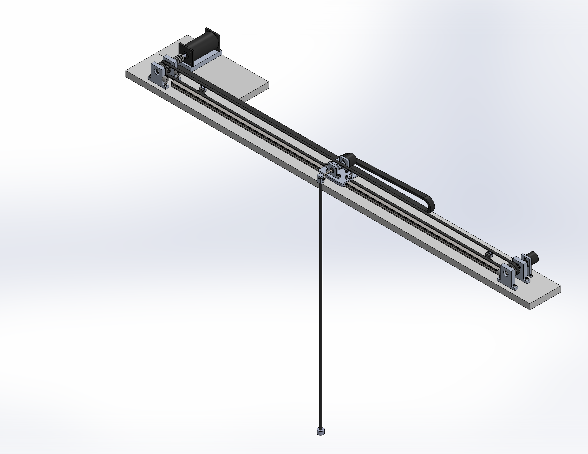

# Inverted-Pendulum-on-a-Cart
*Inverted Pendulum on a Cart implemented in MATLAB/Simulink & Simulink Desktop Real-Time.*

## Project Overview
In this project, I developed blah blah blah. 

## Key Features
* Estimated impulsive maneuvers and drag.
* Accounted for $J2/J3$ and lunar third-body effects.
* Handled simulated range and range-rate measurements.

## Visuals

## Skills Used
**Software:** MATLAB, Simulink, Simulink Desktop Real-Time
**Concepts:** State Estimation, Trajectory Optimization
